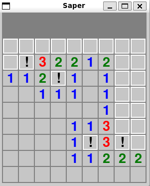
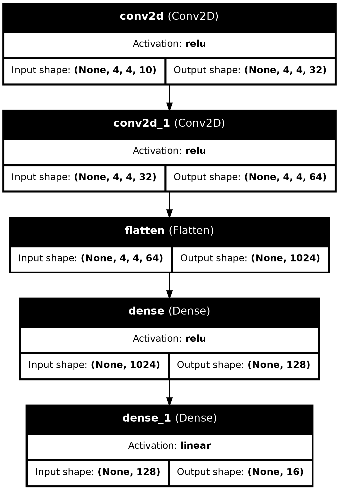
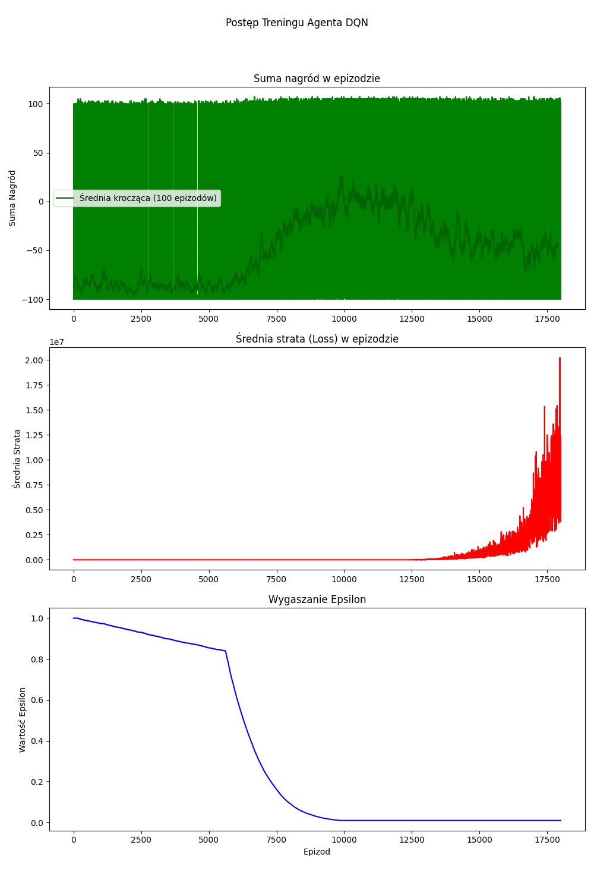
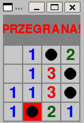

# Agent AI do Gry w Saper

**Autor:** *Mariusz Turzyński*
**Data:** Czerwiec 2025

---

## 1. Wprowadzenie i Cel Projektu

### Opis Problemu
Celem projektu było stworzenie w pełni autonomicznego agenta opartego na sztucznej inteligencji, zdolnego do samodzielnego grania w klasyczną grę Saper. Saper, mimo prostych zasad, jak się przekonałem, stanowi ciekawe wyzwanie ze względu na konieczność logicznego wnioskowania w warunkach niepełnej informacji oraz podejmowania decyzji w sytuacjach niepewnych.

### Główne Cele
* **Implementacja środowiska gry:** Stworzenie w pełni funkcjonalnej, elastycznej implementacji gry Saper.
* **Badanie różnych strategii AI:** Zaimplementowanie i porównanie kilku różnych podejść do stworzenia agenta, od prostych modeli opartych na logice, po zaawansowane uczenie przez wzmacnianie.
* **Analiza porównawcza:** Ilościowe zmierzenie i porównanie skuteczności poszczególnych agentów w celu wyłonienia najlepszej strategii.

### Użyte Technologie
* **Język programowania:** Python
* **Interfejs graficzny:** Pygame
* **Uczenie maszynowe:** TensorFlow / Keras
* **Biblioteki pomocnicze:** NumPy, Matplotlib

---

## 2. Środowisko Gry: Saper

Podstawą projektu jest w pełni zaimplementowane od zera środowisko gry. Logika gry została zamknięta w klasie `MinesweeperGame`, która zarządza stanem planszy, rozmieszczeniem min i mechaniką gry.

Kluczowym ulepszeniem w stosunku do standardowych implementacji jest **gwarancja bezpiecznego pierwszego ruchu**. Plansza i miny są generowane dopiero po pierwszym odsłonięciu kafelka przez użytkownika, co zapewnia, że pierwszy ruch nigdy nie kończy się porażką.

Dla celów interakcji z użytkownikiem oraz demonstracji działania agentów, stworzono interfejs graficzny przy użyciu biblioteki Pygame.

*Rys. 1: Interfejs graficzny zaimplementowanej gry.*

#### Poziomy trudności

Na potrzeby porównania działannia agentów w środowiskach różnym stopniu złożoności, odtworzono oryginalne poziomy trudnośći

* `EASY` wielkość planszy: 9x9, ilość min: 10
* `MEDIUM` wielkość planszy: 16x16, ilość min: 40
* `HARD` wielkość planszy: 30x16, ilość min: 99

Jednak w celu ułatwienia problemu dodałem również

* `BABY` wielkość planszy: 4x4, ilość min: 4

---

## 3. Zastosowane Modele Agentów (Ewolucja Rozwiązania)

W ramach projektu stworzono i przeanalizowano trzy różne modele agentów, reprezentujące kolejne etapy złożoności.

### 3.1. Agent Bazowy: `SimpleAgent`
* **Opis:** Pierwszy, najprostszy model oparty na czystej, deterministycznej logice. Agent skanuje planszę w poszukiwaniu pól, które na 100% są bezpieczne lub na 100% są minami, bazując na informacjach z odkrytych cyfr.
* **Ograniczenia:** Główną wadą tego podejścia jest brak strategii na radzenie sobie z niepewnością. W sytuacji, gdy nie ma już żadnych pewnych ruchów, agent "utknął" i nie był w stanie kontynuować gry, co znacząco ograniczyło jego skuteczność.

### 3.2. Proste Ulepszenie: `GuessingAgent`
* **Opis:** To rozszerzenie Agenta Prostego. Wykorzystuje on tę samą logikę, ale w momencie, gdy utknie, zamiast się poddawać, wykonuje ruch losowy, klikając w jedno z pozostałych ukrytych pól.
* **Ograniczenia:** Mimo że agent zawsze kończy grę, jego "zgadywanie" jest całkowicie naiwne i nie opiera się na żadnym prawdopodobieństwie, co prowadzi do wielu niepotrzebnych porażek.

### 3.3. Model Zaawansowany: Agent DDQN
Głównym modelem badawczym jest agent oparty o głębokie uczenie przez wzmacnianie, a konkretnie o architekturę **Deep Double Q-Network (DDQN)**. Agent ten uczy się optymalnej strategii poprzez metodę prób i błędów na tysiącach rozegranych gier.

#### Mechanizm Nauki Agenta
Agent DDQN opiera się na kilku kluczowych, eleganckich koncepcjach, które pozwalają mu uczyć się efektywnej strategii. Celem agenta jest nauka tzw. **funkcji wartości akcji Q(s, a)**, która szacuje łączną, zdyskontowaną nagrodę, jakiej agent może się spodziewać po wykonaniu akcji `a` w stanie `s`.

**1. Bufor Powtórek (Replay Buffer)**

Podstawowym problemem w uczeniu się na podstawie sekwencyjnych doświadczeń jest ich wysoka korelacja – każdy kolejny ruch jest bardzo podobny do poprzedniego. Aby rozwiązać ten problem, agent posiada **bufor powtórek** – rodzaj "pamięci" o stałej pojemności (w naszym projekcie: 10 000). Każda interakcja ze środowiskiem w formie `(stan, akcja, nagroda, następny_stan, koniec_gry)` jest w nim zapisywana. Podczas właściwej fazy nauki, agent losuje z bufora całą paczkę (mini-batch) przypadkowych, nieskorelowanych ze sobą wspomnień. Dzięki temu w jednej iteracji nauki może analizować doświadczenia z różnych etapów gry, co znacząco stabilizuje trening.

**2. Problem "Zbytniego Optymizmu" i Rozwiązanie DDQN**

W standardowym algorytmie DQN sieć neuronowa ma tendencję do nadmiernie optymistycznego szacowania wartości przyszłych nagród. Dzieje się tak, ponieważ ta sama sieć służy zarówno do **wyboru** najlepszej akcji, jak i do **oceny** jej wartości.

Algorytm **DDQN**, który zaimplementowaliśmy, rozwiązuje ten problem poprzez rozdzielenie tych dwóch zadań i użycie dwóch sieci neuronowych:
* **Sieć Główna (`model`):** Aktywnie ucząca się sieć, która służy do **wybierania** najlepszej akcji w danym stanie.
* **Sieć Docelowa (`target_model`):** Rzadziej aktualizowana kopia sieci głównej, która służy jako stabilny punkt odniesienia do **oceny** wartości akcji wybranej przez sieć główną.

Ten podział zapobiega pętli "potwierdzania własnego optymizmu" i prowadzi do bardziej stabilnego i efektywnego treningu.

#### Architektura Sieci
"Mózgiem" agenta jest konwolucyjna sieć neuronowa (CNN), która analizuje stan planszy jako obraz. Poniższy diagram przedstawia jej architekturę.

*Rys. 2: Architektura sieci neuronowej użytej w agencie DDQN.*

#### Proces Treningu
Agent był trenowany przez **18000 epizodów** na poziomie trudności **BABY**. Kluczowe hiperparametry i techniki użyte w procesie treningu to:
* **Algorytm:** Deep Double Q-Network (DDQN) dla stabilizacji nauki.
* **Bufor Powtórek:** Pojemność 10 000 doświadczeń.
* **Współczynnik uczenia:** 0.0001
* **Wygaszanie Epsilon:** Z `1.0` do `0.01` ze współczynnikiem `0.9996`.
* **System Nagród:** Za każde zwycięstwo `+100.0`, za każdy ruch odkrywający minę `-100.0`, za każdy nielegalny ruch (np. odkrycie już odkrytego kafelka) `-5.0`, za przetrwanie ruchu `+1.0`.

#### Wyniki Treningu
Proces nauki był monitorowany, a jego przebieg został zwizualizowany na poniższych wykresach.

*Rys. 3: Postęp treningu agenta DDQN na przestrzeni 18000 epizodów.*

Na górnym wykresie widzimy sumę nagród. Podczas gdy wynik pojedynczej gry jest bardzo losowy, ciemnozielona linia średniej kroczącej do około połowy wyraźnie pokazuje trend wznoszący, dowodząc, że agent z czasem stawał się coraz skuteczniejszy. Niestety jednak gdy w tym stanie napotyka niespodziewane porażki, to strata, na śodkowym wykresie zaczyna gwałtownie wzrastać. Prowadzi to do spadku skuteczności, a przy wartości Epsilon na poziomie 0.01 wyjście z tej sytuacji jest bardzo mało prawdopodobne. 

---

## 4. Wyniki Końcowe i Analiza Porównawcza

W celu obiektywnego porównania skuteczności wszystkich zaimplementowanych agentów, przeprowadzono serię testów metodą Monte Carlo, polegającą na rozegraniu **10000 gier** przez każdego z agentów na poziomie trudności **BABY** oraz **EASY**. Do oceny wybrano wytrenowany model DDQN z epizodu, w którym osiągnął on szczytową formę.

| Agent | Poziom Trudności | Liczba Gier | Skuteczność (Wygrane) |
| :--- | :--- | :---: | :---: |
| `SimpleAgent` | BABY (4x4) | 10000 | ***19.93%*** |
| `GuessingAgent` | BABY (4x4) | 10000 | ***46.07%*** |
| `DQNAgent` | BABY (4x4) | 10000 | ***49.30%*** |

*Tabela 1: Porównanie skuteczności agentów na poziomie BABY.*

| Agent | Poziom Trudności | Liczba Gier | Skuteczność (Wygrane) |
| :--- | :--- | :---: | :---: |
| `SimpleAgent` | EASY (9x9) | 10000 | ***58.92%*** |
| `GuessingAgent` | EASY (9x9) | 10000 | ***80.35%*** |
| `DQNAgent` | EASY (9x9) | 10000 | ***??.??%*** |

*Tabela 2: Porównanie skuteczności agentów na poziomie EASY.*

`SimpleAgent`, oparty wyłącznie na deterministycznej logice, osiągnął najniższą skuteczność (19.93%) na poziomie BABY, ponieważ jego strategia nie pozwalała na ukończenie gier wymagających podjęcia ryzyka. Wprowadzenie prostego mechanizmu losowego zgadywania w `GuessingAgent` drastycznie poprawiło wyniki do 46.07%, co dowodzi, że sama zdolność do kontynuowania gry jest kluczowa. Poziom EASY wygląda podobnie, jeżeli chodzi o różnice pomiędzy nimi, jednak wartości są zdecydowanie większe. Wynika to z tego, że na poziomie EASY, jedynie 1/8 pól to miny, a na BABY to aż 1/4, co zmusza do częstszego zgadywania lub utknięcia w przypadku `SimpleAgent`. Najlepszy model, `DQNAgent` na poziomie BABY, osiągnął najwyższą skuteczność (49.30%). Choć przewaga nad losowym zgadywaniem jest niewielka, pokazuje ona, że sieć neuronowa nauczyła się podejmować "inteligentne", oparte na wzorcach decyzje w sytuacjach niepewnych, co daje jej mierzalną przewagę nad czystą losowością.

---

## 5. Demonstracja Działania

Działanie wytrenowanego agenta DQN można zaobserwować w czasie rzeczywistym za pomocą przygotowanego interfejsu graficznego.

*Rys. 4: Przykładowa rozgrywka agenta DDQN.*

---

## 6. Wnioski i Dalsze Kroki

### Wnioski
Zrealizowany projekt dowodzi, że możliwe jest skuteczne zastosowanie głębokiego uczenia przez wzmacnianie do nauki gry w Saper. Kluczowym wyzwaniem okazała się złożoność problemu i tzw. problem rzadkiej nagrody, co sprawiło, że trening na większych planszach był bardzo czasochłonny. Eksperymenty wykazały, że nawet prosty agent DQN jest w stanie nauczyć się strategii przewyższającej losowe zgadywanie. Najważniejszym wnioskiem jest jednak to, że sukces w tak złożonym zadaniu wymaga nie tylko zaawansowanego algorytmu, ale również starannego projektowania (np. gwarancja bezpiecznego startu), odpowiednich hiperparametrów oraz dużej ilości danych treningowych. Połączenie prostych heurystyk z modelami uczącymi się stanowi obiecujący kierunek dla tego typu problemów.

### Dalsze Kroki
Projekt ma duży potencjał do dalszego rozwoju. Możliwe kierunki ulepszeń to:
* Spowolnienie wygaszania Epsilon w celu przedłużenia eksploracji
* Potencjalnie rezygnacja z nagrody za zwyczajne odkrycie pola i kompletna eliminacja rozważania nielegalnych ruchów
* Zastosowanie **Priorytetyzowanego Bufora Powtórek (PER)** w celu przyspieszenia i ustabilizowania nauki.
* Eksperymenty z alternatywnymi architekturami sieci, np. **w pełni konwolucyjnymi (FCN)**.
* Dłuższy trening i ewaluacja agenta na wyższych poziomach trudności.
